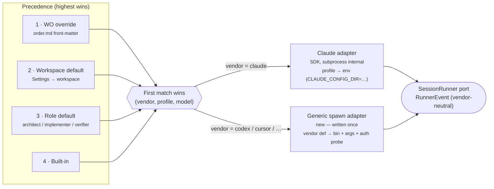

# Multi-CLI provider architecture — 2026-09-25

A design note, not a work order — no product code changed. Question: **how does Docket grow from
one fixed agent adapter (Claude Code) into operator-selectable vendors (Codex, Cursor, …), while
keeping ADR-0014's bar (machine-readable mode, never terminal scraping)?** Feeds: a future ADR-0014
addendum, and the work orders in the phase list below.

## The personal itch this started from — already solved today

The operator runs two Claude Code identities on one machine: a default config using a z.ai GLM
key, and `~/.claude-anthropic` using an Anthropic Max subscription. No new code was needed:
`src/adapters/runner/index.ts:613-620` already layers a backend profile's `env` over `process.env`
before spawning, and the Claude Agent SDK's own subprocess honors `CLAUDE_CONFIG_DIR`. Verified
live in the running app (2026-09-25):

| profile | env | `Test et` result |
|---|---|---|
| Varsayılan (built-in) | inherited | Hazır |
| `claude-anthropic` | `CLAUDE_CONFIG_DIR=/Users/eneskaradeniz/.claude-anthropic` | Hazır |
| `deneme` (sanity check) | `CLAUDE_CONFIG_DIR=/tmp/olmayan-bir-klasor` | Bulunamadı |

The third row is the control: a bogus path correctly failed, proving the override is actually read
rather than silently falling back to the default. **Multiple accounts of the SAME vendor are a
solved problem via WO-0098's existing `BackendProfile` mechanism.** Everything below is about a
DIFFERENT vendor (Codex, Cursor, …), which `BackendProfile` cannot reach — that needs a new
adapter, not a new env line.

## Reference: how nexu-io/open-design does it

[github.com/nexu-io/open-design](https://github.com/nexu-io/open-design) runs 26 different agent
CLIs (claude, codex, cursor-agent, copilot, opencode, aider, antigravity, …) from one daemon.
Findings from reading its source (shallow clone, 2026-09-25):

- **No SDK anywhere, including for Claude.** Every agent — Claude included — is a plain
  `child_process.spawn(command, args)` call (`connectionTest.ts:2704`, `cli.ts:3145`). One spawn
  call site for the whole codebase.
- **One contract per vendor**, `RuntimeAgentDef` (`runtimes/types.ts`): `id`, `bin`,
  `fallbackBins`, `versionArgs`, `authProbe`, `capabilityFlags` (probed live off `--help` output),
  `streamFormat`. `apps/daemon/src/runtimes/defs/claude.ts` is one such definition — `bin: 'claude'`,
  `authProbe: { args: ['auth', 'status'] }`.
- **Three output families**: machine-readable JSON stream (majority — cursor-agent and copilot
  both use `--output-format json`/`stream-json`), plain stdout text parsing (6 CLIs: aider,
  antigravity, atomcode, deepseek, qwen, grok-build), and two RPC transports (ACP, a bidirectional
  Pi protocol). **Only the first family is compatible with ADR-0014** — the plain-stdout family is
  exactly the "terminal scraping" ADR-0014 rejects; we should not copy it, and any vendor that only
  offers plain output stays a named "not yet" the same way agy currently does.
- **Auto-discovery** scans PATH plus well-known toolchain directories (Homebrew, `~/.local/bin`,
  `~/.bun/bin`, node-version-manager dirs, npm prefixes) — `executables.ts:94-108` — because a GUI-
  launched process's PATH is usually thinner than a login shell's. A per-agent `<ID>_BIN` env
  override is the escape hatch when detection misses. Detection results stream in as each probe
  finishes rather than blocking on all of them (`detection.ts:824-898`).
- **A second account of the same vendor is NOT found by shell-alias scanning.** It is a declared
  profile file, `~/.open-design/agents.local.json` (`local-profiles.ts`): `{id, baseAgent, env,
  name}`, derived from the base agent's definition. This is the same shape as Docket's own
  `BackendProfile` — validates the directory-picker design already sketched for Docket's "add
  another Claude account" flow (no need to build alias/rc parsing).

## Proposed mechanism

Three axes, two of which already exist:

1. **Vendor** (claude | codex | cursor | …) — **new axis**. Does not exist today; the composition
   root calls exactly one adapter unconditionally.
2. **Profile** (which named env/account within a vendor) — **exists** (`BackendProfile`, WO-0098).
3. **Role → tier** (which model per session role) — **exists** (`RoleModels`,
   `app-settings.ts`), but assumes a fixed vendor.

The extension: widen `RoleModels`-shaped preferences into a per-role `{vendor, profile, model}`
route, resolved by the SAME precedence chain WO-0098 already uses for profiles (most specific
wins): work order (`order.md` front-matter) → workspace default → role-level account-wide default
→ built-in. No new mental model — one more axis riding an existing chain.

Both branches converge on the same `RunnerEvent` union — the Konsol, cost tracking and permission
flow never learn which vendor ran (ADR-0006/ADR-0014's existing vendor-neutrality, unchanged).

## Phases

- **A — Role → vendor routing.** Widen `RoleModels` into a per-role `{vendor, profile, model}`;
  add a vendor selector to the composition root. Claude stays on its SDK path. No new vendor
  required to land this phase — pure plumbing, de-risks everything after it.
- **B — Generic CLI-spawn adapter.** One adapter that spawns an arbitrary binary and parses its
  declared machine-readable stream, parametrized by a per-vendor definition (`RuntimeAgentDef`-
  shaped). Written once; every subsequent vendor is a definition file, not a new adapter.
- **C — First real second vendor.** Whichever CLI is prioritized (open question below) gets a
  WO-0095-style probe against the ADR-0014 bar (cost on the result message, plan-gate signal,
  permission holds, quota windows) before a definition + adapter wiring lands.
- **D — Auto-discovery + wizard.** PATH plus well-known toolchain dirs (the open-design lesson);
  wire the already-designed onboarding wizard (Welcome → pick a provider → add an account → create
  workspace) to the real detection + profile data.
- **E — Settings surface.** Global default, workspace override, work-order override, and the new
  role override, all reading/writing the one precedence chain from Phase A.

## Open decision

Phase C needs a first target: **Codex CLI or Cursor CLI?** Order changes Phase C's concrete scope
(each vendor's auth probe and stream format differ) but not the shape of A/B/D/E.
